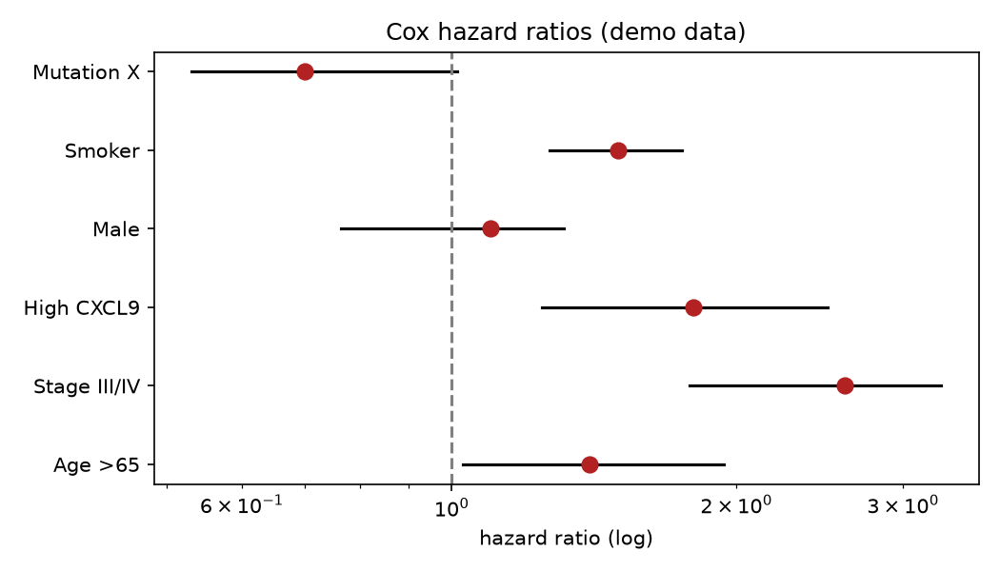

# Survival Hazard Forest

A Kaplan-Meier curve compares two groups. A forest plot answers the harder question all at once: which of many factors independently raise or lower a patient's risk, and by how much?

## Why This Matters

Cox regression gives each covariate a hazard ratio: above 1 means higher risk, below 1 means protective, and the confidence interval says whether you can trust it. A forest plot lines them all up against the HR=1 line, so a reader sees at a glance which factors matter and which cross into non-significance.

## How It Works

1. Fit a multivariate Cox model with all covariates.
2. Extract each hazard ratio and its confidence interval.
3. Plot them as points with error bars against the HR=1 reference.

## What the Demo Shows



The demo shows six covariates. Points to the right of the dashed line (like advanced stage) raise risk; the one to the left is protective; intervals crossing the line are inconclusive — exactly how you would read out an independent prognostic model.

## Run It

```bash
pip install -r requirements.txt
python demo.py
```

> Demonstrated on synthetic data, so it's fully reproducible with no external downloads.
